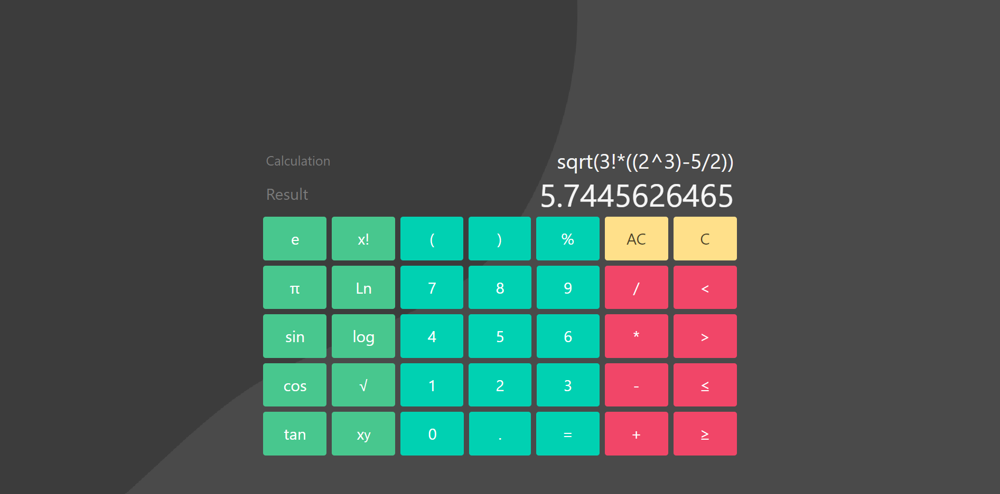

# TS-Calculator 1.0.0

* A simple calculator frontend build with TypeScript. 
* Math parsing is done with [`mathjs`](https://www.npmjs.com/package/mathjs).

## Authors
- **Manjana** - [manjana](https://github.com/blue-hexagon)

## License
This project is licensed under the MIT License - see the [LICENSE.md](LICENSE) file for details
